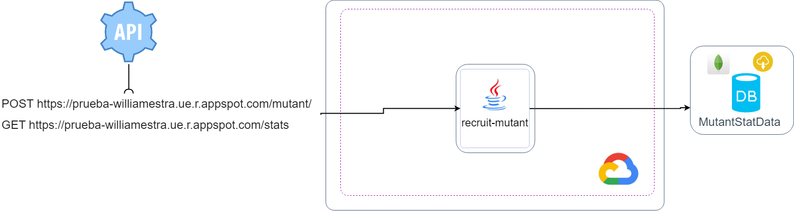

# recruit-mutants

**DUEÑO FUNCIONAL DE LA SOLUCIÓN**

| **Nombre**     | William Estrada |
| ------------ | ----- |
| **Contacto** |   3013551781    |

# Arquitectura



### **Como ejecutar el microservicio localmente**
* SDK java 11
* Gradle 6.4 o mayor

Realizar build del ms y ejecutar. (No requiere ajustes previos)


### **Descripción de la necesidad**

| **Nombre de la interfaz:** | **recruit-mutant**                                            |
| -------------------------- | ------------------------------------------------------------ |
| **Qué**                    | Permite validar el dna       |
| **Porqué**                 | Magneto quiere reclutar la mayor cantidad de mutantes |
| **Para que**               | Derrotar a los X-men |

Mensaje de Ejemplo Origen
==================

>   Este es el mensaje del JSON  que ingresa
 

```
api path POST: /mutant/

{
    "dna":["TTTT","TTCA","GGTA","TGAG"]
}


api path GET: /stats


>No requiere mensaje de entrada

```


Mensaje de Respuesta
==================

```
api path POST: /mutant/

Mutante!!!


api path GET: /stats

{
    "countMutantDna": 41,
    "countHumanDna": 40,
    "ratio": 1.025
}

```
